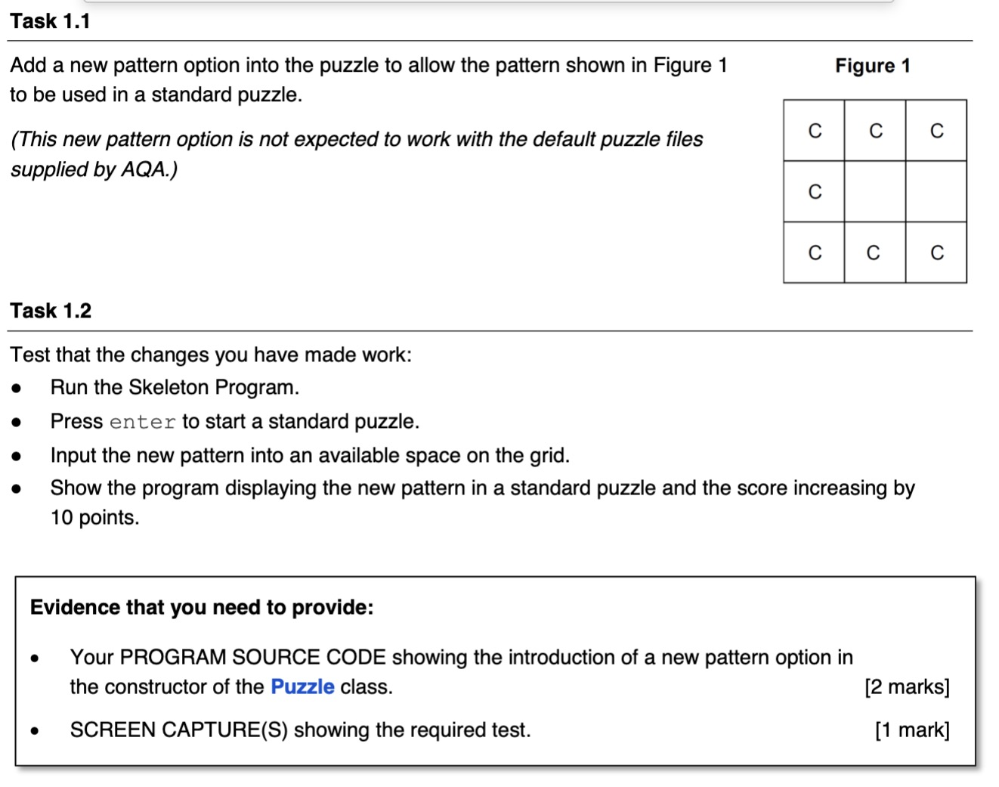
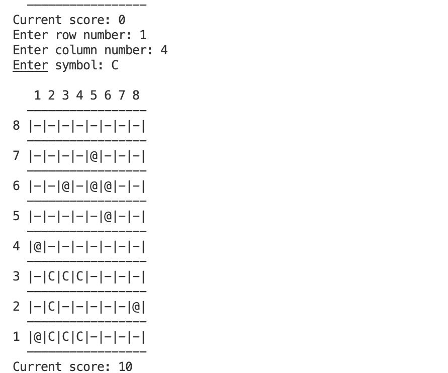

<!-- Add image -->


# Solution Walkthrough

To add a new pattern option for the puzzle as depicted in Figure 1, we will modify the `Puzzle` class to include this new pattern in the standard puzzle setup. The pattern shown is a "C" shape, covering three columns on the top and bottom rows and a single column in the center row. We need to incorporate this specific arrangement into the puzzle's logic.

Here’s the plan:

1. **Define a new Pattern object for this "C" shape.**
2. **Modify the `CheckforMatchWithPattern` method in the `Puzzle` class to handle this new pattern.**

Here's the code snippet for these modifications:

### Step 1: Define the new Pattern
We will add the creation of this pattern in the `Puzzle` constructor for standard puzzles. The pattern sequence here is a string representing the symbol layout across the rows. We'll use "." to represent empty or irrelevant spaces, and "C" to indicate where the pattern's symbol needs to be placed. For simplicity, the sequence is:

- Top row: "CCC"
- Middle row: "C.."
- Bottom row: "CCC"

This translates to a pattern sequence "CCC.CCCC." to account for spiral transitions from top to bottom rows through the middle:


### Step 2: Modify `CheckforMatchWithPattern` to include the new pattern
We'll add logic to this method to check if the symbols in the specified grid positions match this new pattern.

Here’s the revised part of the `Puzzle` class with these additions:

```python
# Changes: Added a new shape pattern "C" to the puzzle game
# Lines: 55-62


class Puzzle():
    def __init__(self, *args):
        # Existing initialization logic...
        if len(args) == 1:
            # Existing file loading logic...
        else:
            # Existing standard puzzle setup...
            # Add the new "C" shape pattern
            CPattern = Pattern("C", "CCC*CCCC*")
            self.__AllowedPatterns.append(CPattern)
            self.__AllowedSymbols.append("C")
```

# Screen Capture with the result:

